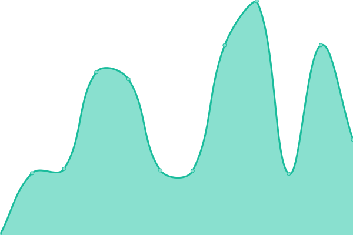

# [📈 Live Status](https://e5-status.xicro.pp.ua): <!--live status--> **🟩 All systems operational**

This repository contains the open-source uptime monitor and status page for [Xicrosoft](https://linktr.ee/xicrosoft), powered by [Upptime](https://github.com/upptime/upptime).

With [Upptime](https://upptime.js.org), you can get your own unlimited and free uptime monitor and status page, powered entirely by a GitHub repository. We use [Issues](https://github.com/Xicrosoft/e5-uptime/issues) as incident reports, [Actions](https://github.com/Xicrosoft/e5-uptime/actions) as uptime monitors, and [Pages](https://e5-status.xicro.pp.ua) for the status page.

<!--start: status pages-->
<!-- This summary is generated by Upptime (https://github.com/upptime/upptime) -->
<!-- Do not edit this manually, your changes will be overwritten -->
<!-- prettier-ignore -->
| URL | Status | History | Response Time | Uptime |
| --- | ------ | ------- | ------------- | ------ |
|  [Renew X 1](https://e5-1.xicro.pp.ua) | 🟩 Up | [renew-x-1.yml](https://github.com/Xicrosoft/e5-uptime/commits/HEAD/history/renew-x-1.yml) | 

 534ms
     
 | 

<a href="https://e5-status.xicro.pp.ua/history/renew-x-1">100.00%</a>
    

|  [Renew X 2](https://e5-2.xicro.pp.ua) | 🟩 Up | [renew-x-2.yml](https://github.com/Xicrosoft/e5-uptime/commits/HEAD/history/renew-x-2.yml) | 

 473ms
     
 | 

<a href="https://e5-status.xicro.pp.ua/history/renew-x-2">100.00%</a>
    

|  [Renew X 3](https://e5-3.xicro.pp.ua) | 🟩 Up | [renew-x-3.yml](https://github.com/Xicrosoft/e5-uptime/commits/HEAD/history/renew-x-3.yml) | 

 589ms
     
 | 

<a href="https://e5-status.xicro.pp.ua/history/renew-x-3">100.00%</a>
    

|  [Renew X 4](https://e5-4.xicro.pp.ua) | 🟩 Up | [renew-x-4.yml](https://github.com/Xicrosoft/e5-uptime/commits/HEAD/history/renew-x-4.yml) | 

 919ms
     
 | 

<a href="https://e5-status.xicro.pp.ua/history/renew-x-4">100.00%</a>
    

|  [Renew X 5](https://e5-5.xicro.pp.ua) | 🟩 Up | [renew-x-5.yml](https://github.com/Xicrosoft/e5-uptime/commits/HEAD/history/renew-x-5.yml) | 

 307ms
     
 | 

<a href="https://e5-status.xicro.pp.ua/history/renew-x-5">100.00%</a>
    

<!--end: status pages-->

[**Visit our status website →**](https://e5-status.xicro.pp.ua)

## 📄 License

- Powered by: [Upptime](https://github.com/upptime/upptime)
- Code: [MIT](./LICENSE) © [Anand Chowdhary](https://anandchowdhary.com), supported by [Pabio](https://pabio.com)
- Data in the `./history` directory: [Open Database License](https://opendatacommons.org/licenses/odbl/1-0/)
